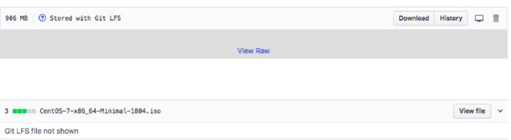

File System & Algorithms used in Git
+++++++++++++++++++++++++++++++++++++

File System
~~~~~~~~~~~~

Git uses LFS file system to manage storing of blob items.

Storing Large content files eventually consumes a huge amount of space on the Git Server.

Moreover, since Git is a Distributed Version Control System, every clone and every checkout or pull of this
repository will have to download each version of this huge file present on the Server; unlike Centralized
Systems wherein just the latest version is downloaded.

Git LFS server comes to our rescue in terms of storing huge files.

Git LFS is a system for managing and versioning large files in association with a Git repository:

- Instead of storing the large files within the Git repository as blobs, Git LFS stores special "pointer files" in the repository

- The contents of the large file are downloaded automatically when needed, for example when a Git branch containing the large file is checked out.

- Git LFS works by using a "smudge" filter to look up the large file contents based on the pointer file, and a "clean" filter to create a new version of the pointer file when the large file's contents change.

- It also uses a pre-push hook to upload the large file contents to the Git LFS server whenever a commit containing a new large file version is about to be pushed to the corresponding Git server.

How LFS works?
~~~~~~~~~~~~~~

Git LFS is a system for managing and versioning large files of upto 2GM in association with a Git repository.
Instead of storing the large files within the Git repository as blobs, Git LFS stores special "pointer files" in
the repository, while storing the actual file contents on a Git LFS server.  The contents of the large file are
downloaded automatically when needed, for example when a Git branch containing

.. image:: images/fs1.jpg

.. image:: images/fs1.jpg

.. image:: images/fs1.jpg

Install git lfs

.. code-block:: bash

    sudo apt install git-lfs

.. code-block:: bash

    ❯ git lfs install
    Git LFS initialized.

.. code-block:: bash

    ❯ git lfs track "*.iso" "*.tar"
    Tracking "*.iso"
    Tracking "*.tar"

.. code-block:: bash

    ❯ git lfs track
    Listing tracked patterns
       *.iso (.gitattributes)
       *.tar (.gitattributes)
    Listing excluded patterns

Tracking information is stored in .gitattributes file, add this file and rest of the files to the repository.

.. code-block:: bash

    ❯ git add . ; git commit -m "Added LFS object" ; git push origin master

Verify the files on the Git server and local repository.

FLS files stored on the LFS Server and not on the Git Server.

Snapshot from GitHub Server shows an LFS file is available only in the RAW form; as it is stored on a LFS Server.

Algorithms
~~~~~~~~~~~~

