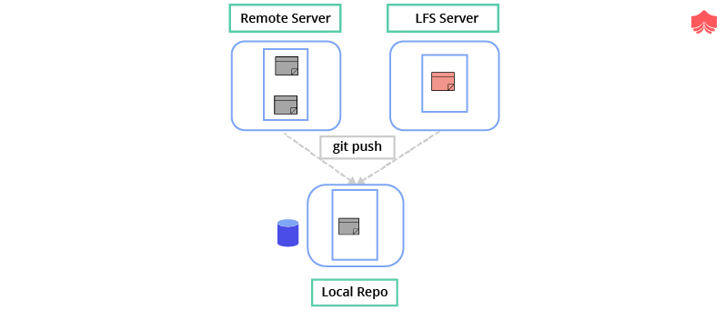

File System & Algorithms used in Git
+++++++++++++++++++++++++++++++++++++

File System
~~~~~~~~~~~~

Git uses LFS file system to manage storing of blob items.

Storing Large content files eventually consumes a huge amount of space on the Git Server.

Moreover, since Git is a Distributed Version Control System, every clone and every checkout or pull of this
repository will have to download each version of this huge file present on the Server; unlike Centralized
Systems wherein just the latest version is downloaded.

Git LFS server comes to our rescue in terms of storing huge files.

Git LFS is a system for managing and versioning large files in association with a Git repository:

- Instead of storing the large files within the Git repository as blobs, Git LFS stores special "pointer files" in the repository

- The contents of the large file are downloaded automatically when needed, for example when a Git branch containing the large file is checked out.

- Git LFS works by using a "smudge" filter to look up the large file contents based on the pointer file, and a "clean" filter to create a new version of the pointer file when the large file's contents change.

- It also uses a pre-push hook to upload the large file contents to the Git LFS server whenever a commit containing a new large file version is about to be pushed to the corresponding Git server.

How LFS works?
~~~~~~~~~~~~~~

Git LFS is a system for managing and versioning large files of upto 2GM in association with a Git repository.
Instead of storing the large files within the Git repository as blobs, Git LFS stores special "pointer files" in
the repository, while storing the actual file contents on a Git LFS server.  The contents of the large file are
downloaded automatically when needed, for example when a Git branch containing

Install git lfs

.. code-block:: bash

    sudo apt install git-lfs

.. code-block:: bash

    ❯ git lfs install
    Git LFS initialized.

.. code-block:: bash

    ❯ git lfs track "*.iso" "*.tar"
    Tracking "*.iso"
    Tracking "*.tar"

.. code-block:: bash

    ❯ git lfs track
    Listing tracked patterns
       *.iso (.gitattributes)
       *.tar (.gitattributes)
    Listing excluded patterns

Tracking information is stored in .gitattributes file, add this file and rest of the files to the repository.

.. code-block:: bash

    ❯ git add . ; git commit -m "Added LFS object" ; git push origin master

Verify the files on the Git server and local repository.

FLS files stored on the LFS Server and not on the Git Server.

Snapshot from GitHub Server shows an LFS file is available only in the RAW form; as it is stored on a LFS Server.

.. image:: images/fs4.png

Data Structures & Algorithms
~~~~~~~~~~~~~~~~~~~~~~~~~~~~~~~

There are several different data structures used in git.

Object storage (under .git/obects/) is a shallow trie — the root is a directory containing 256 subdirectories,
one for each possible value of the high-order byte of the 20 byte blob ID.

Pack files use a hash table to keep track of the blobs in the pack; this structure is also used in memory — blobs
and pack files are memory-mapped using the mmap(2) system call.

Finally, commits, tags, and directory blobs comprise a directed acyclic graph (DAG), linked together by their object
IDs. The directory structure is represented as a tree, but commits and tags form a more complicated structure because
of branching and merging. The acyclic nature of the DAG is a natural consequence of the fact that links are
represented by hashes.

Algorithms
~~~~~~~~~~~

**Source Code Differencing**

Existing differencing techniques use similarities in names and structure to match code
elements at a particular granularity, such as text-based and abstract-syntax-tree-based
(AST).
Tree-based differencing techniques are widely used nowadays (e.g., diff in Unix), since
they are expected to have better understandability than the text-based.

Diff Algorithms in Git
~~~~~~~~~~~~~~~~~~~~~~~

Diff is an automatic comparison program used to find the disagreements between the older
and the newer version of the same file in a storage (including insertions, deletions, document
renaming, document movements etc.). The diff utility extracts code changes line by line
in one file compared to the other file and reports them in a list. The operation of the diff
program has been fundamentally solved by using the longest common subsequence (LCS) problem.

**Myers**

Myers algorithm was developed by Myers (1986). In the git diff command, this algorithm
is used as the default. The operation of this algorithm traces the two primary
identical sequences recursively with the least edited script. Since the Myers only notices
the sequences which are actually equal in both, the comparison between the other prior and
posterior subsequences is executed repetitively for the entire remaining sequences.

**Histogram**

The Histogram algorithm is the enhanced version of Patience, which was built by Bram
Cohen who is renowned as the BitTorrent developer. It supports low-occurrence common
elements which are applied to improve efficiency. The Histogram was initially built in jgit
and was introduced in git 1.7.7.

**Merkle Trees**
~~~~~~~~~~~~~~~~~

.. image:: images/f8.png

A hash tree or Merkle tree is a tree in which every leaf node is labeled with the cryptographic hash of a data block,
and every non-leaf node is labeled with the cryptographic hash of the labels of its child nodes. Because of this
characteristic, Merkle Trees are used to verify that two or more parties have the same data without exchanging
the entire data collection. Git computes a SHA-1 over the contents of that directory tree, and stores this together
with metadata. The metadata includes information such as a pointer to a parent commit as well as author information
and a commit message as a commit object.

Here are some of the major benefits of Merkle trees:

- They provide a way of proving the integrity and validity of data. Even a small tamper of data will result in a completely different hash.

- Their proofs only require tiny amounts of information to be transmitted across networks. They separate the validation of data from the data itself.

``Tree`` can be compared to a ``directory`` and ``blob`` to a ``file``.

Now, if we change the contents of the first file, the corresponding hash would change, and this change would go all the way to the root of the tree.

**FILE CHANGED**

This helps Git to maintain two versions for a repository efficiently and this is how it stores the entire history spanning thousands of commits locally for millions of lines of code.

