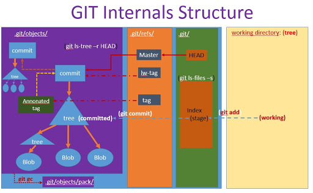
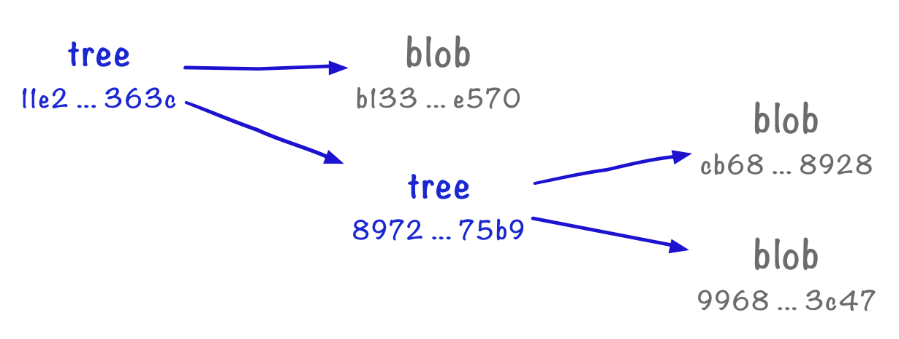
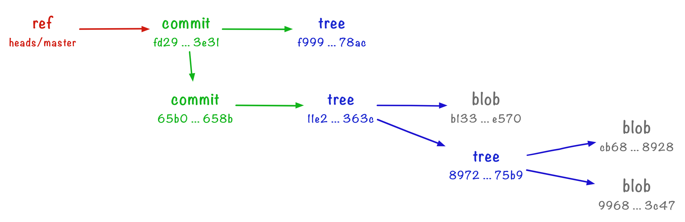

Git Plumbing System
+++++++++++++++++++++++++++++++++++++++++++

**What is Plumbing?**

The Git system is broadly divided into 2 parts:

- Porcelain: It refers to a set of commands that cover the underlying plumbing operations at a high level with easy and appealing names for end users. The commands you use daily to interact with your remote repo are Porcelain.

- Plumbing: These commands take care of the low level operations, which form the fundamental base on which Git is built.

Refer to `this link <https://mirrors.edge.kernel.org/pub/software/scm/git/docs/git.html>`_ for a list of all such commands.

The Git Plumbing system has the following major parts:

- **Objects** ``(dir)``: store all the content for the database
- **Refs** ``(dir)``: store pointers into commit objects in that data (branches)
- **HEAD** ``(file)``: points to the branch you currently have checked out
- **Index** ``(file)``: stores your staging area information and acts like a temporary snapshot for the repo

Demonstrating Simple Git Plumbing Commands
~~~~~~~~~~~~~~~~~~~~~~~~~~~~~~~~~~~~~~~~~~~

**Git Objects**
~~~~~~~~~~~~~~~~

Make a repo:

.. code-block:: bash

    mkdir plumbing-repo
    cd plumbing-repo

Initialize an empty git repo:

.. code-block:: bash

    git init

See the contents:

.. code-block:: bash

    ls .git

Create a file

.. code-block:: bash

    echo "This is a sample file for testing git plumbing" > sample.txt

Hash the file

.. code-block:: bash

    git hash-object -w sample.txt

Find the hashed file:

.. code-block:: bash

    find .git/objects -type f

Cat the file with its hash:

.. code-block:: bash

    git cat-file -p 18a4906282bd994b870b651a00b9d421e4df4a99

**Blobs and Trees**
~~~~~~~~~~~~~~~~~~~~

Adding files to the index

In Git, the index or staging area is a temporary snapshot of your repository. It’s a collection of files that
have been modified, but not yet saved to the permanent history. In a porcelain Git workflow, you add files
to the index with git add, then take a snapshot of the index with git commit. With plumbing, there are
several extra steps.

We can save a file to the index with the update-index command:

.. code-block:: bash

    git update-index --add sample.txt

.. note:: Note that if you haven’t saved a file already with hash-object, it’s done automatically for you.

If we look in the .git directory, there’s a new file index:

.. code-block:: bash

    ls .git

We can see what we’ve added to the index with the plumbing command ls-files:

.. code-block:: bash

    git ls-files

Taking a permanent copy of the index

To take permanent copies of the snapshot, we need another plumbing command: write-tree:

.. code-block:: bash

    git write-tree

We’ve got back a hash – this is another Git object!

.. code-block:: bash

    find .git/objects -type f

Let’s inspect it with cat-file:

.. code-block:: bash

    git cat-file -p dc6b8ea09fb7573a335c5fb953b49b85bb6ca985

.. code-block:: bash

    ❯ git cat-file -p a79dae98a3c7b0299544270733ae9b0b920ffe72
    100644 blob 18a4906282bd994b870b651a00b9d421e4df4a99	sample.txt

.. code-block:: bash

    ❯ git cat-file -t a79dae98a3c7b0299544270733ae9b0b920ffe72
    tree

.. code-block:: bash

    ❯ git cat-file -t 18a4906282bd994b870b651a00b9d421e4df4a99
    blob

.. note:: A blob object stores the contents of a file, but doesn’t know what the file is called.
          Those are what we created in part 1. Now we’re creating tree objects, which know what files are called.
          A tree can point to a blob to describe the file contents.

Context from commits
~~~~~~~~~~~~~~~~~~~~~

We can create a commit from a tree with the commit-tree command, by giving the hash of a tree we created:

.. code-block:: bash

    ❯ echo "initial commit" | git commit-tree a79dae98a3c7b0299544270733ae9b0b920ffe72

We pass a message and the ID of a tree, and we get back another object ID – like everything else, commits are objects!

We can inspect its type:

.. code-block:: bash

    git cat-file -t 76a1c6e5c5a0f8e506f365cc7c24f785b7b1bcaa
    commit

We can see it in the Git object store:

.. code-block:: bash

     find .git/objects -type f

And we can pretty-print its contents:

.. code-block:: bash

    ❯  git cat-file -p 76a1c6e5c5a0f8e506f365cc7c24f785b7b1bcaa
    tree a79dae98a3c7b0299544270733ae9b0b920ffe72
    author Saki Osive <saki.osive@gmail.com> 1614894359 +0530
    committer Saki Osive <saki.osive@gmail.com> 1614894359 +0530

    initial commit

The first line is a pointer to the tree.

The second and third lines give some information about the author and committer – their name, email address, and a Unix timestamp. The author is the person who wrote a patch, while the committer is the person who checks that patch into the codebase. Usually they’re the same person, but they can differ (especially on large projects like the Linux kernel) – so there are separate fields.

Finally, the rest of the commit is the fre text message – usually called a commit message. This allows us to include any other details that might explain the significance of this snapshot.

This commit has far more context than our original tree: it tells us when it was created, who by, and the free text message lets us include any other relevant details.

Refs and branches
~~~~~~~~~~~~~~~~~~~

Creating our first branch

If we look, we see it just contains two empty directories:

.. code-block:: bash

     ls .git/refs

We can use the update-ref command to create a named reference to a commit. Like so:

.. code-block:: bash

    ❯ git update-ref refs/heads/master 76a1c6e5c5a0f8e506f365cc7c24f785b7b1bcaa

If you have another look inside .git/refs, you’ll see a new file has been created:

    find .git/refs -type f
    .git/refs/heads/master

    ❯ cat .git/refs/heads/master
    76a1c6e5c5a0f8e506f365cc7c24f785b7b1bcaa

The reference master is a pointer to a commit. Anywhere we might use the commit ID, we can use master as a more convenient shortcut. This is what it looks like:

Let’s use the ref in an example:

.. code-block:: bash

    ❯ git cat-file -p master
    tree a79dae98a3c7b0299544270733ae9b0b920ffe72
    author Saki Osive <saki.osive@gmail.com> 1614894359 +0530
    committer Saki Osive <saki.osive@gmail.com> 1614894359 +0530

    initial commit

We can check the value of a ref with the rev-parse command:

.. code-block:: bash

    ❯ git rev-parse master
    76a1c6e5c5a0f8e506f365cc7c24f785b7b1bcaa

Now let’s create another commit, and see what happens to our branch. Notice that I can pass the parent commit with our named ref:

.. code-block:: bash

    ❯ echo "This is another sample file" > sample2.txt

    ❯ git update-index --add sample2.txt

    ❯ git write-tree
    4e62a4c93af1e3f51b705a65e554ca19f27877a4

    ❯ echo "Added sampel2.txt" | git commit-tree 4e62a4c93af1e3f51b705a65e554ca19f27877a4
    27e0019cf81fdba6f695a4a1e3ae25e2e2486788

So we have a new commit, and we can see it if we run git log:

.. code-block:: bash

    ❯  git log --oneline 27e0019cf81fdba6f695a4a1e3ae25e2e2486788
    27e0019 Added sampel2.txt

Checking the commit on the master branch:

.. code-block:: bash

    ❯ git log --oneline master
    76a1c6e (HEAD -> master) initial commit

So, this gives an overview of Git's plumbing commands and shows how Git works internally.

Appendix
~~~~~~~~~~~

- List of all commands:

   To get all these commands, run

.. code-block:: bash

    git help -a

.. code-block:: text

    Main Porcelain Commands
       add                  Add file contents to the index
       am                   Apply a series of patches from a mailbox
       archive              Create an archive of files from a named tree
       bisect               Use binary search to find the commit that introduced a bug
       branch               List, create, or delete branches
       bundle               Move objects and refs by archive
       checkout             Switch branches or restore working tree files
       cherry-pick          Apply the changes introduced by some existing commits
       citool               Graphical alternative to git-commit
       clean                Remove untracked files from the working tree
       clone                Clone a repository into a new directory
       commit               Record changes to the repository
       describe             Give an object a human readable name based on an available ref
       diff                 Show changes between commits, commit and working tree, etc
       fetch                Download objects and refs from another repository
       format-patch         Prepare patches for e-mail submission
       gc                   Cleanup unnecessary files and optimize the local repository
       gitk                 The Git repository browser
       grep                 Print lines matching a pattern
       gui                  A portable graphical interface to Git
       init                 Create an empty Git repository or reinitialize an existing one
       log                  Show commit logs
       merge                Join two or more development histories together
       mv                   Move or rename a file, a directory, or a symlink
       notes                Add or inspect object notes
       pull                 Fetch from and integrate with another repository or a local branch
       push                 Update remote refs along with associated objects
       range-diff           Compare two commit ranges (e.g. two versions of a branch)
       rebase               Reapply commits on top of another base tip
       reset                Reset current HEAD to the specified state
       restore              Restore working tree files
       revert               Revert some existing commits
       rm                   Remove files from the working tree and from the index
       shortlog             Summarize 'git log' output
       show                 Show various types of objects
       sparse-checkout      Initialize and modify the sparse-checkout
       stash                Stash the changes in a dirty working directory away
       status               Show the working tree status
       submodule            Initialize, update or inspect submodules
       switch               Switch branches
       tag                  Create, list, delete or verify a tag object signed with GPG
       worktree             Manage multiple working trees

    Ancillary Commands / Manipulators
       config               Get and set repository or global options
       fast-export          Git data exporter
       fast-import          Backend for fast Git data importers
       filter-branch        Rewrite branches
       mergetool            Run merge conflict resolution tools to resolve merge conflicts
       pack-refs            Pack heads and tags for efficient repository access
       prune                Prune all unreachable objects from the object database
       reflog               Manage reflog information
       remote               Manage set of tracked repositories
       repack               Pack unpacked objects in a repository
       replace              Create, list, delete refs to replace objects

    Ancillary Commands / Interrogators
       annotate             Annotate file lines with commit information
       blame                Show what revision and author last modified each line of a file
       bugreport            Collect information for user to file a bug report
       count-objects        Count unpacked number of objects and their disk consumption
       difftool             Show changes using common diff tools
       fsck                 Verifies the connectivity and validity of the objects in the database
       gitweb               Git web interface (web frontend to Git repositories)
       help                 Display help information about Git
       instaweb             Instantly browse your working repository in gitweb
       merge-tree           Show three-way merge without touching index
       rerere               Reuse recorded resolution of conflicted merges
       show-branch          Show branches and their commits
       verify-commit        Check the GPG signature of commits
       verify-tag           Check the GPG signature of tags
       whatchanged          Show logs with difference each commit introduces

    Interacting with Others
       archimport           Import a GNU Arch repository into Git
       cvsexportcommit      Export a single commit to a CVS checkout
       cvsimport            Salvage your data out of another SCM people love to hate
       cvsserver            A CVS server emulator for Git
       imap-send            Send a collection of patches from stdin to an IMAP folder
       p4                   Import from and submit to Perforce repositories
       quiltimport          Applies a quilt patchset onto the current branch
       request-pull         Generates a summary of pending changes
       send-email           Send a collection of patches as emails
       svn                  Bidirectional operation between a Subversion repository and Git

    Low-level Commands / Manipulators
       apply                Apply a patch to files and/or to the index
       checkout-index       Copy files from the index to the working tree
       commit-graph         Write and verify Git commit-graph files
       commit-tree          Create a new commit object
       hash-object          Compute object ID and optionally creates a blob from a file
       index-pack           Build pack index file for an existing packed archive
       merge-file           Run a three-way file merge
       merge-index          Run a merge for files needing merging
       mktag                Creates a tag object
       mktree               Build a tree-object from ls-tree formatted text
       multi-pack-index     Write and verify multi-pack-indexes
       pack-objects         Create a packed archive of objects
       prune-packed         Remove extra objects that are already in pack files
       read-tree            Reads tree information into the index
       symbolic-ref         Read, modify and delete symbolic refs
       unpack-objects       Unpack objects from a packed archive
       update-index         Register file contents in the working tree to the index
       update-ref           Update the object name stored in a ref safely
       write-tree           Create a tree object from the current index

    Low-level Commands / Interrogators
       cat-file             Provide content or type and size information for repository objects
       cherry               Find commits yet to be applied to upstream
       diff-files           Compares files in the working tree and the index
       diff-index           Compare a tree to the working tree or index
       diff-tree            Compares the content and mode of blobs found via two tree objects
       for-each-ref         Output information on each ref
       get-tar-commit-id    Extract commit ID from an archive created using git-archive
       ls-files             Show information about files in the index and the working tree
       ls-remote            List references in a remote repository
       ls-tree              List the contents of a tree object
       merge-base           Find as good common ancestors as possible for a merge
       name-rev             Find symbolic names for given revs
       pack-redundant       Find redundant pack files
       rev-list             Lists commit objects in reverse chronological order
       rev-parse            Pick out and massage parameters
       show-index           Show packed archive index
       show-ref             List references in a local repository
       unpack-file          Creates a temporary file with a blob's contents
       var                  Show a Git logical variable
       verify-pack          Validate packed Git archive files

    Low-level Commands / Syncing Repositories
       daemon               A really simple server for Git repositories
       fetch-pack           Receive missing objects from another repository
       http-backend         Server side implementation of Git over HTTP
       send-pack            Push objects over Git protocol to another repository
       update-server-info   Update auxiliary info file to help dumb servers

    Low-level Commands / Internal Helpers
       check-attr           Display gitattributes information
       check-ignore         Debug gitignore / exclude files
       check-mailmap        Show canonical names and email addresses of contacts
       check-ref-format     Ensures that a reference name is well formed
       column               Display data in columns
       credential           Retrieve and store user credentials
       credential-cache     Helper to temporarily store passwords in memory
       credential-store     Helper to store credentials on disk
       fmt-merge-msg        Produce a merge commit message
       interpret-trailers   Add or parse structured information in commit messages
       mailinfo             Extracts patch and authorship from a single e-mail message
       mailsplit            Simple UNIX mbox splitter program
       merge-one-file       The standard helper program to use with git-merge-index
       patch-id             Compute unique ID for a patch
       sh-i18n              Git's i18n setup code for shell scripts
       sh-setup             Common Git shell script setup code
       stripspace           Remove unnecessary whitespace

