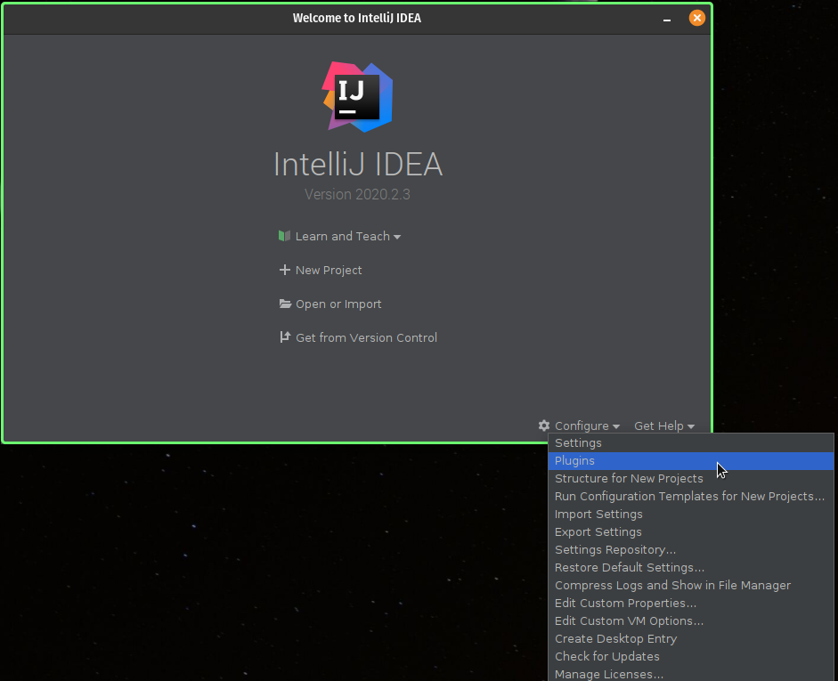
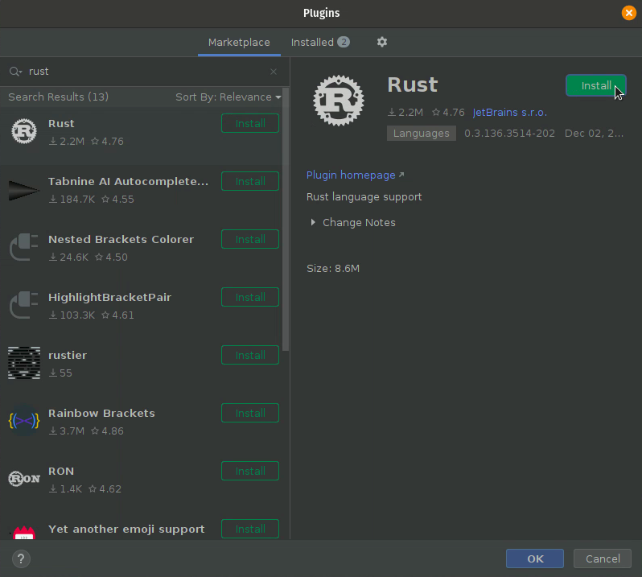
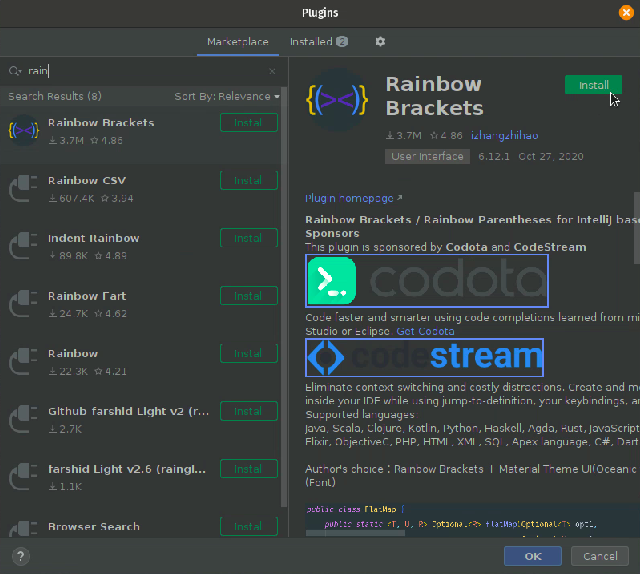
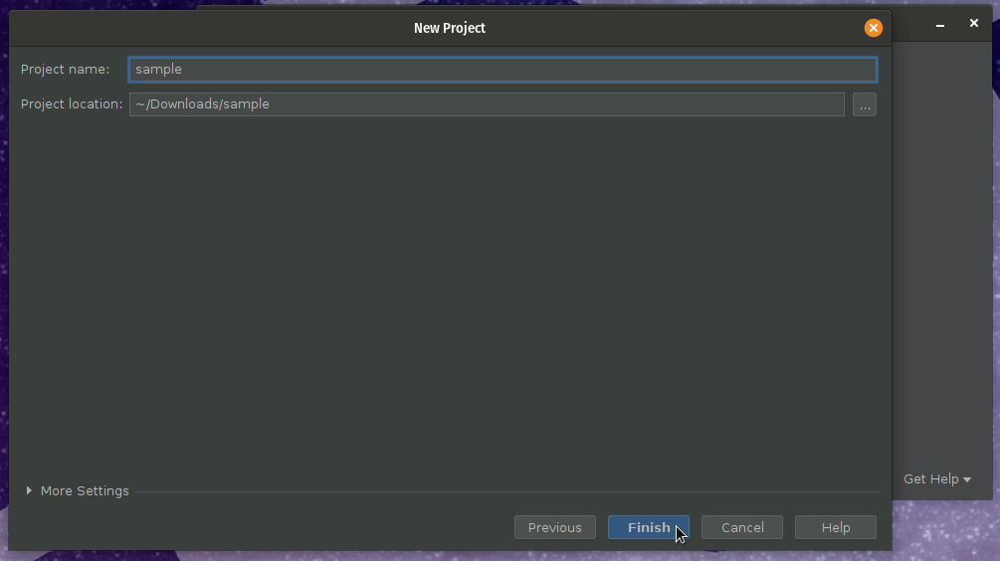
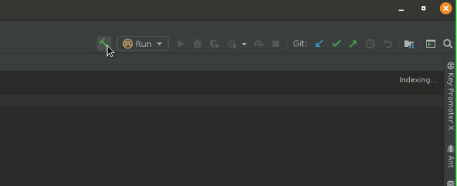
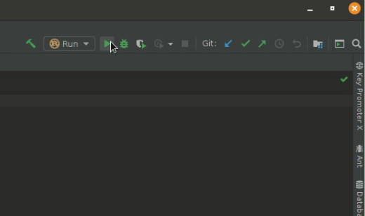

.. RustInstallDoc documentation master file, created by
   sphinx-quickstart on Wed Dec  2 09:23:50 2020.
   You can adapt this file completely to your liking, but it should at least
   contain the root `toctree` directive.

Installing Rust in Ubuntu
==========================================

- Open terminal and enter the following command

.. code-block:: bash

   curl https://sh.rustup.rs -sSf | sh

- Choose ‘Proceed with installation (default)’ by entering 1

You should get a message after installation saying:

.. code-block:: bash

   Rust is installed now. Great!

- Add the following line to your ~/.bash_profile :

.. code-block:: bash

   export PATH=”$HOME/.cargo/bin:$PATH”

Run the following command :

.. code-block:: bash

   sudo cp ~/.cargo/bin/rustc /usr/local/bin/

Run the following command to check if Rust is installed successfully :

.. code-block:: bash

   rustc --version

**Running Rust Sample Project in IntelliJ IDEA**

Open IDE and go to ``Plugins``.

Search for ``Toml``, ``Rust`` and ``Rainbow Brackets`` and install them.

Install and click ``OK``.

Restart the IDE and click ``New Project``.

Select ``Rust``.

Name your project.

The project will be shown as this. Build the project.

Run the Project.

The output will be displayed as shown below.

