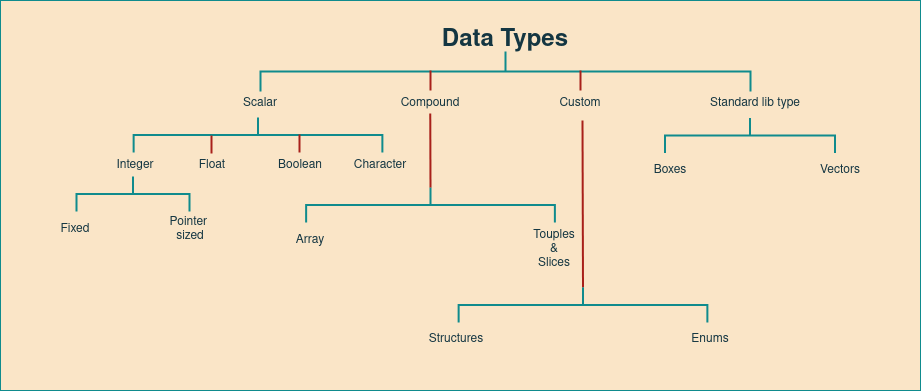

Data Types in RUST
+++++++++++++++++++

Every value in Rust is of a certain data type, which tells Rust what kind of data is being specified so it knows how to work with that data.

* Rust is a statically typed language, which means that it must know the types of all variables at compile time.
* The compiler can usually infer what type we want to use based on the value and how we use it.

Scalar Types
=============

* A scalar type represents a single value.
* Rust has four primary scalar types:

    #. Integers
    #. Floating-point numbers
    #. Booleans
    #. Characters

Integer
---------

* An integer is a number without a fractional component.
* Integers are broadly classified into two types

    * Fixed sized
    * Pointer sized integers

Fixed Sized Integers
'''''''''''''''''''''

    .. image:: ./images/fixedSize.png

    **Syntax:**

    .. code-block:: rust

        // Syntax1
        let variable_name = value;

        // Syntax2
        let variable_name:type = value;

    **Example**

    .. code-block:: rust

        // default Integer type is 'i32'
        let a = 0;

        // define variable `b` with type `i64` and assign value 44
        let b: i64 = 44;

        // assign value of `11` with type `u32`  to `c`
        let c = 11u32;

Pointer Sized Integers
'''''''''''''''''''''''

    .. image:: images/pointerSized.png

    **Example:***

    .. code-block:: rust

        let index = 13usize;

Floating Point
--------------

* Rust also has two primitive types for floating-point numbers, which are numbers with decimal points.
* Rust’s floating-point types are ``f32`` and ``f64``, which are 32 bits and 64 bits in size, respectively.
* The default type is ``f64`` because on modern CPUs it’s roughly the same speed as ``f32`` but is capable of more precision.
* Floating-point numbers are represented according to the IEEE-754 standard. The ``f32`` type is a single-precision float, and ``f64`` has double precision.

    .. image:: images/floatingType.png

    .. note:: Every part of a floating-point number after the integer part is optional, but at least one of the fractional part, exponent, or type suffix must be present, to distinguish it from an integer literal. The fractional part may consist of a lone decimal point, so 5. is a valid floating-point constant.

    .. image:: images/floatsInt.png

    **Example:** src/main.rs

    .. code-block:: rust

        fn main() {
        let x = 2.0; // By default it is f64

        let y: f32 = 3.0; // f32
        }

Boolean
--------

* As in most other programming languages, a Boolean type in Rust has two possible values: ``true`` and ``false``.
* Booleans are one byte in size.
* The Boolean type in Rust is specified using ``bool``.

    **Example:**

    .. code-block:: rust

        fn main() {
            let t = true;

            let f: bool = false; // with explicit type annotation

            // Boolean are often produced by the comparison operators
            let is_greater = 5 > 10;
            let is_equal = 5 == 5;

        }

Characters
----------

* Rust’s char type is four bytes in size and represents a Unicode Scalar Value, which means it can represent a lot more than just ASCII.
* ``char`` literals are specified with single quotes, as opposed to string literals, which use double quotes.

    **Example:**

    .. code-block:: rust

        fn main() {
            let c = 'z';
            let z = 'ℤ';
            let heart_eyed_cat = '😻';

            // as ASCII char (00-7F)
            let a = '\x62';

            // as Unicode char
            let b '\u{62}';
        }

Compound Types
===============

``Compound types`` can group multiple values into one type. Rust has two primitive compound types: tuples and arrays.

Array
------

* Arrays represent fixed number of values of another type
* Unlike a tuple, every element of an array must have the same type.
* Arrays types are written like [T; N], where

    - T - type of array elements
    - N - array size (constant)

* Arrays in Rust are different from arrays in some other languages because arrays in Rust have a fixed length, like tuples.

    **Syntax:**

    .. code-block:: rust

        //Syntax1
        let variable_name = [value1,value2,value3];

        //Syntax2
        let variable_name:[dataType;size] = [value1,value2,value3];

        //Syntax3
        let variable_name:[dataType;size] = [default_value_for_elements,size];

    **Example: Program to declare arrays**

    .. code-block:: rust

        fn main() {
        // Using Syntax1
        let a = [1, 2, 3, 4, 5];

        let months = ["January", "February", "March", "April", "May", "June", "July",
              "August", "September", "October", "November", "December"];

        // Using Syntax2 (`i32` is the type of each element.)
        let b: [i32; 5] = [1, 2, 3, 4, 5];

        // Using Syntax3 (array named `c` will contain `5` elements that will all be set to the value `3` initially).
        let c: [i32 ;5] = [3; 5];
        }

    **Example: Accessing Array Elements**

    .. code-block:: rust

        fn main() {
            // Access elements of an array using indexing
            let a = [1, 2, 3, 4, 5];

            let first = a[0];
            let second = a[1];
        }

Tuples
-------

* A tuple is a general way of ``grouping together a number of values with a variety`` of types into one compound type.
* Tuples have a fixed length: once declared, they cannot grow or shrink in size.
* We create a tuple by writing a comma-separated list of values inside parentheses.
* Each position in the tuple has a type, and the types of the different values in the tuple don’t have to be the same.
* Tuple may have upto 12 elements at maximum.

    **Syntax:**

    .. code-block:: rust

        //Syntax1
        let tuple_name:(data_type1,data_type2,data_type3) = (value1,value2,value3);

        //Syntax2
        let tuple_name = (value1,value2,value3);

    **Example: Program to declare tuple**

    .. code-block:: rust

        fn main() {
        // Using Syntax1
        let tup: (i32, f64, u8) = (500, 6.4, 1);

        // Using Syntax2
        let tuple = (500, 6.4, 1);
        }

    .. note:: The variable ``tup`` binds to the entire tuple, because a tuple is considered a single compound element.

    **Example: Program to access individual values out of tuple using destructing.**

    .. code-block:: rust

        fn main() {
        let tup = (500, 6.4, 1);

        let (x, y, z) = tup;

        println!("The value of y is: {}", y);
        }

    .. note:: This program first creates a tuple and binds it to the variable ``tup``. It then uses a pattern with ``let`` to take ``tup`` and turn it into three separate variables, `x`, `y`, and `z`. This is called **destructuring**, because it breaks the single tuple into three parts. Finally, the program prints the value of ``y``, which is 6.4.

    **Example: Program to access individual values out of tuple using Pattern Matching**

    .. code-block:: rust

        fn main() {
            let x: (i32, f64, u8) = (500, 6.4, 1);

            let five_hundred = x.0;

            let six_point_four = x.1;

            let one = x.2;
        }

    .. note:: We can access a tuple element directly by using a period (``.``) followed by the index of the value we want to access.

Slices
-------

* A slice, written [T] without specifying the length, is a region of an array or vector.
* Slices are similar to arrays, but their length is not known at compile time.
* Slices are pointers to the actual data. They are passed by reference to functions, which is also known as **borrowing**.

    **Syntax:**

    .. code-block:: rust

        let <sliced_value> = &data_structure[start_index..end_index]

    **Example:**

    .. code-block:: rust

        fn main() {
           let n1 = "Tutorials".to_string();
           println!("length of string is {}",n1.len());
           let c1 = &n1[4..9];

           // fetches characters at 4,5,6,7, and 8 indexes
           println!("{}",c1);
        }

    **Output:**

    .. code-block::

        length of string is 9
        rials

Custom Types
============

Structures
----------

* A struct, or structure, is a custom data type that lets you name and package together multiple related values that make up a meaningful group.
* A structure defines data as a key-value pair.

Declaring a structure
'''''''''''''''''''''''

    **Syntax:**

    .. code-block:: rust

        struct structure-name {
           field1:data_type,
           field2:data_type,
           field3:data_type
        }

    **Example:**

    .. code-block:: rust

        struct Employee {
           name:String,
           team:String,
           age:u32
        };

Initializing a structure
'''''''''''''''''''''''''

    **Syntax:**

    .. code-block:: rust

        let instance_name = Name_of_structure {
           field1:value1,
           field2:value2,
           field3:value3
        };

    **Example:**

    .. code-block:: rust

        let emp1 = Employee {
          team:String::from("Osive"),
          name:String::from("Ryo"),
          age:50
        };
        println!("Name is :{}, team is {}, age is {}.",emp1.name,emp1.team,emp1.age);

    **Output:**

    .. code-block::

        Name is :Ryo, team is Osive, age is 50.

Enum (Enumeration)
------------------

* When we have to select a value from a list of possible variants we use enumeration data types.

    **Syntax:**

    .. code-block:: rust

            enum enum_name {
               variant1,
               variant2,
               variant3
            }

    For example any IP address can be either a version four or a version six address, but not both at the same time. So,

    **Example:**

    .. code-block:: rust

        enum IpAddrKind {
            V4,
            V6,
        }

Constants
---------

* Constants represent values that cannot be changed.
* If you declare a constant then there is no way its value changes.
* Constants must be explicitly typed during it's declaration.
* Rust has two different types of constants which can be declared in any scope including global. Both require explicit type annotation:

    * ``const`` - An unchangeable value (the common case).
    * ``static`` - declare global variables. These represent a memory address. They would be rarely used: the primary use cases are global locks, global atomic counters, and interfacing with legacy C libraries.

Const
''''''

    **Syntax:**

    .. code-block:: rust

        const VARIABLE_NAME:dataType = value;

    **Example:**

    .. code-block:: rust

        const PI:f32 = 3.14;

static
'''''''

    **Syntax:**

    .. code-block:: rust

        static VARIABLE_NAME:dataType = value;

    **Example:**

    .. code-block:: rust

        static LANGUAGE: &str = "Rust";

Standard Library Types
=======================

Boxes
-----

* The simplest way to allocate a value in the heap is to use ``Box::new``
* A box is a smart pointer to a heap allocated value of type ``T``.
* When a box goes out of scope, its destructor is called, the inner object is destroyed, and the memory on the heap is freed.

    **Usecases:**

    * When you have a type whose size can’t be known at compile time and you want to use a value of that type in a context that requires an exact size
    * When you have a large amount of data and you want to transfer ownership but ensure the data won’t be copied when you do so
    * When you want to own a value and you care only that it’s a type that implements a particular trait rather than being of a specific type

    **Syntax:**

        .. code-block:: rust

            let VARIABLE_NAME = Box::new(value);

    **Example**

        .. code-block:: rust

            fn main() {
                let a = Box :: new(1);
                print!("value of a is : {}",a);
            }

    **Output**

        .. code-block:: rust

            value of a is : 1

        .. note:: In the above example, a contains the value of Box that points to the data 1. If we access the value of Box, then the program prints '1'. When the program ends, then the Box is deallocated. The box is stored on the stack, and the data that it points to is stored on the heap.

Vectors
--------

* Vectors are re-sizable arrays. Like slices, their size is not known at compile time, but they can grow or shrink at any time.
* It stores values in contiguous memory blocks.
* There are several ways to create vectors. The simplest is to use the ``vec!`` macro, which gives us a syntax for vectors that looks very much like an array literal:

    **Syntax:**

    .. code-block:: rust

        // Syntax1
        let mut instance_name = Vec::new();
        instance_name.push(value);

        //Syntax2
        let vector_name = vec![val1,val2,val3]

    **Example:**

    .. code-block:: rust

        fn main() {
            // Using Syntax1
            let mut v1 = Vec::new();
            v1.push(20);
            println!("v1: {:?}",v1);

            // Using Syntax2
            let v2 = vec![1,2,3];
            println!("v2: {:?}",v2);
            }

    **Output:**

    .. code-block::

        v1: [20]
        v2: [1, 2, 3]

    **Miscellaneous Examples:**

    .. code-block:: rust

        let mut v = vec![10, 20, 30, 40, 50];
        // Make the element at index 3 be 35.
        v.insert(3, 35);
        assert_eq!(v, [10, 20, 30, 35, 40, 50]);
        // Remove the element at index 1.
        v.remove(1);
        assert_eq!(v, [10, 30, 35, 40, 50]);

        let mut v = vec!["Snow Puff", "Glass Gem"];
        assert_eq!(v.pop(), Some("Glass Gem"));

        // A palindrome!
        let mut palindrome = vec!["a man", "a plan", "a canal", "panama"];
        palindrome.reverse();

Strings
--------

* A ``String`` is stored as a vector of bytes (``Vec<u8>``), but guaranteed to always be a valid UTF-8 sequence. ``String`` is heap allocated, growable and not null terminated.
* The String data type in Rust can be classified into the following −

    * String Literal(&str)
    * String Object(String)

String Literal(&str)
''''''''''''''''''''''

* String literals (&str) are used when the value of a string is known at compile time.
* String literals are a set of characters, which are hardcoded into a variable.
* String literals are static by default. This means that string literals are guaranteed to be valid for the duration of the entire program.

    **Syntax:**

    .. code-block:: rust

        let variable_name: &str = "value";

    **Example:**

    .. code-block:: rust

        fn main() {
           let team:&str="Osive";
           let location:&str = "Delhi";
           println!("Team is :{}, Location :{}",team,location);
        }

    **Output:**

    .. code-block:: rust

        Team is :Osive, Location :Delhi

String Object
''''''''''''''

* The String object type is provided in Standard Library. Unlike string literal, the string object type is not a part of the core language.
* It is defined as public structure in standard library pub struct String.
* String is heap allocated, growable and not null terminated.
* It is mutable and UTF-8 encoded type.
* String object type can be used to represent string values that are provided at runtime.

    **Syntax:**

    .. code-block:: rust

        // Syntax1
        let variable_name = String::new()

        // Syntax2
        let variable_name = String::from("value")

    **Example:**

    .. code-block:: rust

        fn main(){
            // Using Syntax1
            let empty_string = String::new();
            println!("length is {}",empty_string.len());

            // Using Syntax2
            let content_string = String::from("Team Osive");
            println!("length is {}",content_string.len());
        }

    **Output:**

    .. code-block::

        length is 0
        length is 10
