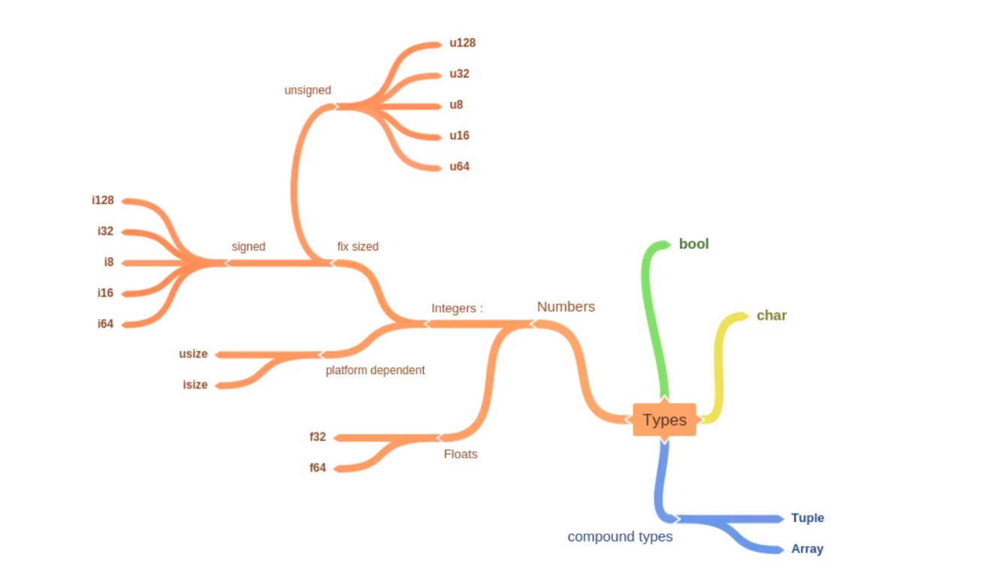

Data Types in RUST
+++++++++++++++++++

Every value in Rust is of a certain data type, which tells Rust what kind of data is being specified so it knows how to work with that data.

There are two types of data types in RUST:

#. Scalar
#. Compound

* Rust is a statically typed language, which means that it must know the types of all variables at compile time.
* The compiler can usually infer what type we want to use based on the value and how we use it.

Scalar Types
=============

* A scalar type represents a single value.
* Rust has four primary scalar types:

    #. Integers
    #. Floating-point numbers
    #. Booleans
    #. Characters

Integer
---------

* An integer is a number without a fractional component.
* Integers are broadly classified into two types

    * Fixed sized
    * Pointer sized integers

    .. image:: ./images/integerTypes.png

Fixed Sized Integers
'''''''''''''''''''''

    .. image:: ./images/fixedSize.png

    **Example**

    .. code-block:: rust

        // default Integer type is 'i32'
        let a = 0;

        // define variable `b` with type `i64` and assign value 44
        let b: i64 = 44;

        // assign value of `11` with type `u32`  to `c`
        let c = 11u32;

Pointer Sized Integers
'''''''''''''''''''''''

    .. image:: images/pointerSized.png

    **Example:***

    .. code-block:: rust

        let index = 13usize;

Floats
------

* Rust also has two primitive types for floating-point numbers, which are numbers with decimal points.
* Rust’s floating-point types are ``f32`` and ``f64``, which are 32 bits and 64 bits in size, respectively.
* The default type is ``f64`` because on modern CPUs it’s roughly the same speed as ``f32`` but is capable of more precision.
* Floating-point numbers are represented according to the IEEE-754 standard. The ``f32`` type is a single-precision float, and ``f64`` has double precision.

    .. image:: images/floatsInt.png

    **Example:** src/main.rs

    .. code-block:: rust

        fn main() {
        let x = 2.0; // f64

        let y: f32 = 3.0; // f32
        }

Boolean
----------------

* As in most other programming languages, a Boolean type in Rust has two possible values: ``true`` and ``false``.
* Booleans are one byte in size.
* The Boolean type in Rust is specified using ``bool``.

    **Example:**

    .. code-block:: rust

        fn main() {
            let t = true;

            let f: bool = false; // with explicit type annotation

            // Boolean are often produced by the comparison operators
            let is_greater = 5 > 10;
            let is_equal = 5 == 5;

        }

Character
------------------

* Rust’s char type is four bytes in size and represents a Unicode Scalar Value, which means it can represent a lot more than just ASCII.
* ``char`` literals are specified with single quotes, as opposed to string literals, which use double quotes.

    **Example:**

    .. code-block:: rust

        fn main() {
            let c = 'z';
            let z = 'ℤ';
            let heart_eyed_cat = '😻';

            // as ASCII char (00-7F)
            let a = '\x62';

            // as Unicode char
            let b '\u{62}';
        }

Compound Types
===============

``Compound types`` can group multiple values into one type. Rust has two primitive compound types: tuples and arrays.

Tuple
------

* A tuple is a general way of ``grouping together a number of values with a variety`` of types into one compound type.
* Tuples have a fixed length: once declared, they cannot grow or shrink in size.
* We create a tuple by writing a comma-separated list of values inside parentheses.
* Each position in the tuple has a type, and the types of the different values in the tuple don’t have to be the same.
* Tuple may have upto 12 elements at maximum.

    **Example: Program to declare tuple**

    .. code-block:: rust

        fn main() {
        let tup: (i32, f64, u8) = (500, 6.4, 1);
        }

    .. note:: The variable ``tup`` binds to the entire tuple, because a tuple is considered a single compound element.

    **Example: Program to access individual values out of tuple using destructing.**

    .. code-block:: rust

        fn main() {
        let tup = (500, 6.4, 1);

        let (x, y, z) = tup;

        println!("The value of y is: {}", y);
        }

    .. note:: This program first creates a tuple and binds it to the variable ``tup``. It then uses a pattern with ``let`` to take ``tup`` and turn it into three separate variables, `x`, `y`, and `z`. This is called **destructuring**, because it breaks the single tuple into three parts. Finally, the program prints the value of ``y``, which is 6.4.

    **Example: Program to access individual values out of tuple using Pattern Matching**

    .. code-block:: rust

        fn main() {
            let x: (i32, f64, u8) = (500, 6.4, 1);

            let five_hundred = x.0;

            let six_point_four = x.1;

            let one = x.2;
        }

    .. note:: We can access a tuple element directly by using a period (``.``) followed by the index of the value we want to access.

Array
------

* Arrays represent fixed number of values of another type
* Unlike a tuple, every element of an array must have the same type.
* Arrays types are written like [T; N], where

    - T - type of array elements
    - N - array size (constant)

* Arrays in Rust are different from arrays in some other languages because arrays in Rust have a fixed length, like tuples.

    **Example: Program to declare arrays**

    .. code-block:: rust

        fn main() {

        let a = [1, 2, 3, 4, 5];

        let months = ["January", "February", "March", "April", "May", "June", "July",
              "August", "September", "October", "November", "December"];

        // `i32` is the type of each element.
        let b: [i32; 5] = [1, 2, 3, 4, 5];

        // array named `c` will contain `5` elements that will all be set to the value `3` initially.
        let c = [3; 5];
        }

    **Example: Accessing Array Elements**

    .. code-block:: rust

        fn main() {
            // Access elements of an array using indexing
            let a = [1, 2, 3, 4, 5];

            let first = a[0];
            let second = a[1];
        }

