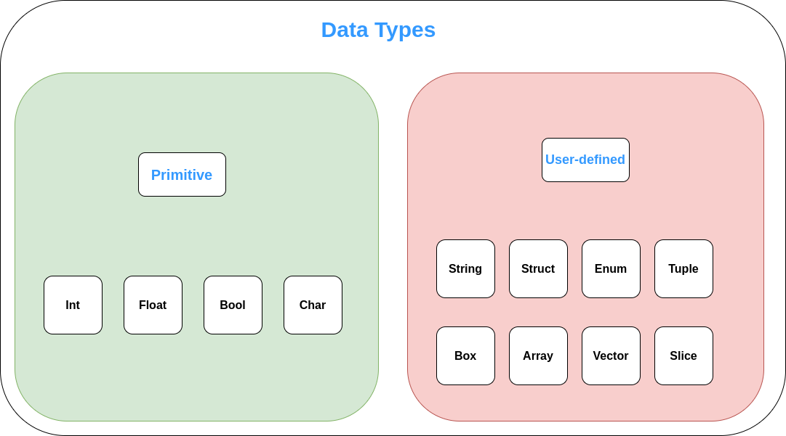

Data Types And Variable Declaration
###################################

Data Types
++++++++++

Primitive Data Types
++++++++++++++++++++

**Int (Integer)**
++++++++++++++++++++++++

Takes integer values and is further divided into 2 types :

- Signed (denoted by i immediately after the colon)

Takes positive as well as negative whole number values. For e.g. 34, -63 etc.

Signed integer is written as :

.. code-block:: rust

    let a:i32 = 3;

This will create an immutable variable a and bind it with the value ``3``. ``i`` denotes that the datatype is
a signed integer. The number after ``i`` determines how many bits to assign in the memory location for the
variable that has been declared. The default value is 32 bits. Other values are 8, 16, 64 and 128 bits.

- Unsigned (denoted by u immediately after the colon)

Takes only positive whole number values. For e.g. 34, 3263, 0 etc.

Unsigned integer is written as :

.. code-block:: rust

    let a:u32 = 3;

This will create an immutable variable a and bind it with the value ``3``. ``u`` denotes that the datatype is
an unsigned integer. The number after ``u`` determines how many bits to assign in the memory location for the
variable that has been declared. The default value is 32 bits.

**F (Float)**
++++++++++++++++++++++++

Takes floating-point values :

Float is written as :

.. code-block:: rust

    let a:f32 = 1.1568;

This will create an immutable variable a and bind it with the value ``3``. ``f`` denotes that the datatype is
a float. The number after ``f`` determines how many bits to assign in the memory location for the
variable that has been declared. The default value is 32 bits. Other values are 8, 16, 64 and 128 bits.

**Bool (Boolean)**
++++++++++++++++++++++++
Takes boolean values i.e. true or false.

Bool is written as :

.. code-block:: rust

    let a:bool = true;

This will create an immutable variable a and bind it with the value ``true``. ``bool`` denotes that the datatype is
a boolean.

**Char (Character)**
++++++++++++++++++++++++
Takes values which span all permissible characters.

Char is written as :

.. code-block:: rust

    let a:char = '%';

This will create an immutable variable a and bind it with the value ``%``. ``char`` denotes that the datatype is
a character. The character must be enclosed by single quotes and must not have more than one character.

**Unicode values as char**

Unicode values can also be passed as char. For e.g. :

.. code-block:: rust

    let  a = '\u{007b}';

This will create an immutable variable ``a`` and assign it the value that corresponds to the respective unicode
value for ``007b``. The syntax is as follows : ``'\u{hex_value_of_the_corresponding_unicode_reference}'``.

According to the example given above, the value assigned to the variable a will be equal to the corresponding value
which the ``007b`` (in hex) i.e. the reference 123 (in decimal) has which is ``{``. Therefore the value assigned to the
variable will be the special character '{'.

User-defined Data Types
+++++++++++++++++++++++

**Array (Array)**
+++++++++++++++++

An array is a collection of objects of the same type T, stored in contiguous memory. Arrays are created using brackets
``[]``, and their length, which is known at compile time, is part of their type signature [T; length].

An array is written as :

.. code-block:: rust

    let a: [i32; 5] = [1, 2, 3, 4, 5];

This will create an array named ``a`` of type ``i32`` whose length is 5. The characters defined in the array are
1, 2, 3, 4 & 5 at the respective positions.

**Slice (Slice)**
++++++++++++++++++++++++

Slices are similar to arrays, but their length is not known at compile time. Instead, a slice is a two-word object,
the first word is a pointer to the data, and the second word is the length of the slice.

We can create slices using a range within brackets by specifying [starting_index..ending_index], where starting_index
is the first position in the slice and ending_index is one more than the last position in the slice. Internally, the
slice data structure stores the starting position and the length of the slice, which corresponds to ending_index minus
starting_index.

A slice is written as :

.. code-block:: rust

    let a = [0..6];

This creates a slice named ``a`` whose length is from ``0`` to ``6`` in memory. The values can be added dynamically to
the slice.

**String (String)**
++++++++++++++++++++++++

A string is a bunch of characters that are stored together inside the double quotes("").

String is written as :

.. code-block:: rust

    let a: &str = "This is a string";

This will create a string named ``a`` and assign it the value ``This is a string``.
All strings have to be inside the double quotes.

**Struct (Structure)**
++++++++++++++++++++++++

There are three types of structures (``structs``) that can be created using the struct keyword:

- Tuple structs, which are, basically, named tuples.
- The classic C structs
- Unit structs, which are field-less, are useful for generics.

Structs is written as :

.. code-block:: rust

    // A unit struct
    struct Unit;

    // A tuple struct
    struct Pair(i32, f32);

    // A struct with two fields
    struct Point {
        x: f32,
        y: f32,
    }

**Enum (Enumeration)**
++++++++++++++++++++++++

The enum keyword allows the creation of a type which may be one of a few different variants. Any variant
which is valid as a struct is also valid as an enum.

An enum is written as :

.. code-block:: rust

    pub enum Switch {
        /// True.
        On,
        /// False.
        Off,
        /// Auto.
        Auto,
    }

**Tuple (Tuple)**
++++++++++++++++++++++++

A tuple is a collection of values of different types.

Tuple is written as :

.. code-block:: rust

    let a:(i32,f64,u8) = (-325,4.9,22);

This will create a tuple named ``a`` with 3 different types of values. The values are then
assigned respectively.

**Box (Box)**
++++++++++++++++++++++++

All values in Rust are stack allocated by default. Values can be boxed (allocated on the heap) by creating a Box<T>.
A box is a smart pointer to a heap allocated value of type T. When a box goes out of scope, its destructor is called,
the inner object is destroyed, and the memory on the heap is freed.

Boxed values can be dereferenced using the * operator; this removes one layer of indirection.

The usage of ``Box`` can be seen as :

.. code-block:: rust

    {
      let a = Box :: new(1);
      print!("value of a is : {}" ,a);
    }

**Vec (Vector)**
++++++++++++++++++++++++

Vectors are re-sizable arrays. Like slices, their size is not known at compile time, but they can grow or shrink at
any time. A vector is represented using 3 parameters:

- Pointer to the data
- Length
- Capacity

The capacity indicates how much memory is reserved for the vector. The vector can grow as long as the length is smaller
than the capacity. When this threshold needs to be surpassed, the vector is reallocated with a larger capacity.

A vector can be written as :

.. code-block:: rust

    Let v : Vec<i32> = Vec::new();

In the above declaration, v is a vector of i32 type and it is created by using Vec::new() function.

There is another way to create the vector:
Rust provides vec! macro to create the vector and hold the values that we provide.

For example:

.. code-block:: rust

    //Initialise with the macro to make the initialization more convenient
    let v = vec![10,20,30,40,50];

Miscellaneous
++++++++++++++

**Closures**
++++++++++++

Closures in Rust, also called lambda expressions or lambdas, are functions that can capture the enclosing environment.

For example, the following closure takes ``x`` and ``y`` as inputs, does operation on them and allows us to use
it as a method.

.. code-block:: rust

    let add = |x, y| -> i32 { x + y };

    let result = add(1, 2);

    println!("{}", result);

For example, a closure to find out the factorial of a function is as follows :

.. code-block:: rust

    fn main(){

    let fact = |x| -> i32 { (1..=x).product() };

        println!("{}", fact(5));

    }

Here, we create a closure and pass ``x`` as parameter and call the product method which iterates over all the numbers
from 1 to ``x``.

The syntax and capabilities of closures make them very convenient for on the fly usage. Calling a closure is exactly
like calling a function. However, both input and return types can be inferred and input variable names must be
specified.

**Pointers**
++++++++++++

A pointer is a general concept for a variable that contains an address in memory. This address refers to, or
``points at`` some other data.

Types of pointers

- **Shared references (&)**

These point to memory owned by some other value. When a shared reference to a value is created it prevents direct
mutation of the value.

.. code-block:: rust

    let my_num: i32 = 10;
    let my_num_ptr: *const i32 = &my_num;

- **Mutable references (&mut)**

These also point to memory owned by some other value. A mutable reference type is written &mut type or &'a mut type.
A mutable reference (that hasn't been borrowed) is the only way to access the value it points to, so is not Copy.

.. code-block:: rust

    let mut my_speed: i32 = 88;
    let my_speed_ptr: *mut i32 = &mut my_speed;

- **Raw pointers (*const and *mut)**

.. code-block:: rust

       * ( mut | const ) TypeNoBounds

Raw pointers are pointers without safety or liveness guarantees. Raw pointers are written as *const T or *mut T,
for example *const i32 means a raw pointer to a 32-bit integer. Copying or dropping a raw pointer has no effect
on the lifecycle of any other value. Dereferencing a raw pointer is an unsafe operation, this can also be used
to convert a raw pointer to a reference by reborrowing it (&* or &mut *).

