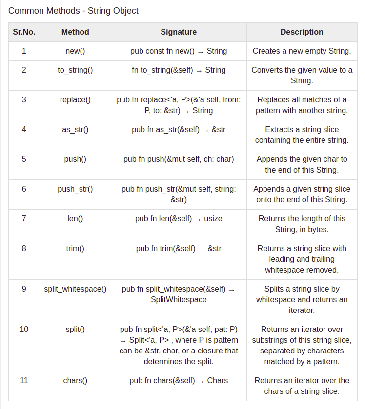

Examples
=========

Hello World
+++++++++++

    .. code-block:: bash

        fn main() {
        println!("Hello World!");
        }

A binary can be generated using the Rust compiler: rustc.

    .. code-block:: bash

        rustc hello.rs

To run the binary 

.. code-block:: bash

    .\hello

Declare a Variable
++++++++++++++++++

Example 1

.. code-block:: bash

    fn main() {
        // Declare a variable binding
        let a_binding;

        {
            let x = 2;

            // Initialize the binding
            a_binding = x * x;
        }

        println!("a binding: {}", a_binding);

        let another_binding;

        // Error! Use of uninitialized binding
        println!("another binding: {}", another_binding);
        // FIXME ^ Comment out this line

        another_binding = 1;

        println!("another binding: {}", another_binding);
    }

Example 2

.. code-block:: bash

    fn main() {
        let company_string = "TutorialsPoint";  // string type
        let rating_float = 4.5;                 // float type
        let is_growing_boolean = true;          // boolean type
        let icon_char = '♥';                    //unicode character type

        println!("company name is:{}",company_string);
        println!("company rating on 5 is:{}",rating_float);
        println!("company is growing :{}",is_growing_boolean);
        println!("company icon is:{}",icon_char);
    }

Example 3

.. code-block:: bash

    fn main() {
        let age:u8 = 255;

        // 0 to 255 only allowed for u8
        let weight:u8 = 256;   //overflow value is 0
        let height:u8 = 257;   //overflow value is 1
        let score:u8 = 258;    //overflow value is 2

        println!("age is {} ",age);
        println!("weight is {}",weight);
        println!("height is {}",height);
        println!("score is {}",score);
    }

Example 4

.. code-block:: bash

    fn main() {
        let fees = 25_000;
        let salary:f64 = 35_000.00;
        println!("fees is {} and salary is {}",fees,salary);
    }

Mutability
++++++++++

Variable bindings are immutable by default, but this can be overridden using the mut modifier

.. code-block:: bash

    fn main() {
        let _immutable_binding = 1;
        let mut mutable_binding = 1;

        println!("Before mutation: {}", mutable_binding);

        // Ok
        mutable_binding += 1;

        println!("After mutation: {}", mutable_binding);

        // Error!
        _immutable_binding += 1;

        // FIXME ^ Comment out this line
    }

Immutable
+++++++++

.. code-block:: bash

    fn main() {
        let fees = 25_000;
        println!("fees is {} ",fees);
        fees = 35_000;
        println!("fees changed is {}",fees);
    }

Strings
+++++++

The String data type in Rust can be classified into the following −

    * String Literal(&str)

    * String Object(String)

String Literal
++++++++++++++

String literals (&str) are used when the value of a string is known at compile time. String literals are a set of characters, which are hardcoded into a variable. For example, let company="Tutorials Point". String literals are found in module std::str. String literals are also known as string slices.

.. code-block:: bash

    fn main() {
        let company:&str="TutorialsPoint";
        let location:&str = "Hyderabad";
        println!("company is : {} location :{}",company,location);
    }

String Object
+++++++++++++

The String object type is provided in Standard Library. Unlike string literal, the string object type is not a part of the core language. It is defined as public structure in standard library pub struct String. String is a growable collection. It is mutable and UTF-8 encoded type. The String object type can be used to represent string values that are provided at runtime. String object is allocated in the heap.

To create a String object, we can use any of the following syntax −

Example 1

.. code-block:: bash

    String::new()

Example 2:- Illustration: ``new()``

An empty string object is created using the new() method and its value is set to hello.

.. code-block:: bash

    fn main(){
        let mut z = String::new();
        z.push_str("hello");
        println!("{}",z);
    }

Example 3:- Illustration: ``to_string()``

To access all methods of String object, convert a string literal to object type using the to_string() function.

.. code-block:: bash

    fn main(){
        let name1 = "Hello TutorialsPoint , 
        Hello!".to_string();
        println!("{}",name1);
    }

Example 4:- Illustration: ``replace()``

The replace() function takes two parameters − the first parameter is a string pattern to search for and the second parameter is the new value to be replaced. In the above example, Hello appears two times in the name1 string.

.. code-block:: bash

    fn main(){
        let name1 = "Hello TutorialsPoint , 
        Hello!".to_string();         //String object
        let name2 = name1.replace("Hello","Howdy");    //find and replace
        println!("{}",name2);
    }

Example 5:- Illustration: ``as_str()``

The as_str() function extracts a string slice containing the entire string.

.. code-block:: bash

    fn main() {
        let example_string = String::from("example_string");
        print_literal(example_string.as_str());
    }
    fn print_literal(data:&str ){
        println!("displaying string literal {}",data);
    }

Example 6:- Illustration: ``push()``

The push() function appends the given char to the end of this String.

.. code-block:: bash

    fn main(){
        let mut company = "Tutorial".to_string();
        company.push('s');
        println!("{}",company);
    }

Example 7:- Illustration: ``push_str()``

The push_str() function appends a given string slice onto the end of a String.

.. code-block:: bash

    fn main(){
        let mut company = "Tutorials".to_string();
        company.push_str(" Point");
        println!("{}",company);
    } 

Example 8:- Illustration: ``len()``

The len() function returns the total number of characters in a string (including spaces).

.. code-block:: bash

    fn main() {
        let fullname = " Tutorials Point";
        println!("length is {}",fullname.len());
    }

Example 9:- Illustration: ``trim()``

The trim() function removes leading and trailing spaces in a string. NOTE that this function will not remove the inline spaces.

.. code-block:: bash

    fn main() {
        let fullname = " Tutorials Point \r\n";
        println!("Before trim ");
        println!("length is {}",fullname.len());
        println!();
        println!("After trim ");
        println!("length is {}",fullname.trim().len());
    }

Example 10 :- Illustration: ``split_whitespace()``

The split_whitespace() splits the input string into different strings. It returns an iterator.

.. code-block:: bash

    fn main(){
        let msg = "Tutorials Point has good t
        utorials".to_string();
        let mut i = 1;
        
        for token in msg.split_whitespace(){
            println!("token {} {}",i,token);
            i+=1;
        }
    }

Example 11 :- Illustration: ``split() string``

The split() string method returns an iterator over substrings of a string slice, separated by characters matched by a pattern. The limitation of the split() method is that the result cannot be stored for later use. The collect method can be used to store the result returned by split() as a vector.

.. code-block:: bash

    fn main() {
        let fullname = "Kannan,Sudhakaran,Tutorialspoint";

        for token in fullname.split(","){
            println!("token is {}",token);
        }

        //store in a Vector
        println!("\n");
        let tokens:Vec<&str>= fullname.split(",").collect();
            println!("firstName is {}",tokens[0]);
            println!("lastname is {}",tokens[1]);
            println!("company is {}",tokens[2]);
    }

Example 12:- Illustration: ``chars()``

Individual characters in a string can be accessed using the chars method. Let us consider an example to understand this.

.. code-block:: bash

    fn main(){
        let n1 = "Tutorials".to_string();

        for n in n1.chars(){
            println!("{}",n);
        }
    }

Float
+++++

Float data type in Rust can be classified as f32 and f64. The f32 type is a single-precision float, and f64 has double precision. The default type is f64. Consider the following example to understand more about the float data type.

.. code-block:: bash

    fn main() {
        let result = 10.00;        //f64 by default
        let interest:f32 = 8.35;
        let cost:f64 = 15000.600;  //double precision
        
        println!("result value is {}",result);
        println!("interest is {}",interest);
        println!("cost is {}",cost);
    }

Boolean
+++++++

Boolean types have two possible values – true or false. Use the bool keyword to declare a boolean variable.

.. code-block:: bash

    fn main() {
        let isfun:bool = true;
        println!("Is Rust Programming Fun ? {}",isfun);
    }

Automatic Type Casting
+++++++++++++++++++++++

Automatic type casting is not allowed in Rust. Consider the following code snippet. An integer value is assigned to the float variable interest.

.. code-block:: bash

    fn main() {
        let interest:f32 = 8;   // integer assigned to float variable
        println!("interest is {}",interest);
    }

Character
+++++++++

The character data type in Rust supports numbers, alphabets, Unicode and special characters. Use the char keyword to declare a variable of character data type. Rust’s char type represents a Unicode Scalar Value, which means it can represent a lot more than just ASCII. Unicode Scalar Values range from U+0000 to U+D7FF and U+E000 to U+10FFFF inclusive.

.. code-block:: bash

    fn main() {
        let special_character = '@'; //default
        let alphabet:char = 'A';
        let emoji:char = '😁';
        
        println!("special character is {}",special_character);
        println!("alphabet is {}",alphabet);
        println!("emoji is {}",emoji);
    }